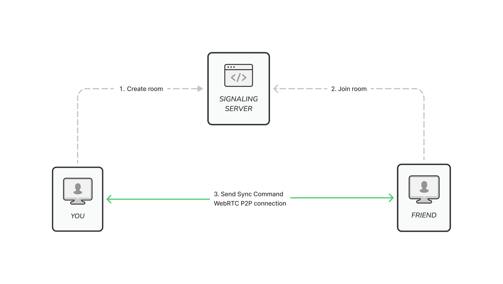

<h1 align="center"> 1Stream Browser Extension </h1> <br>
<p align="center">
  
</p>

<p align="center">
  Watch Youtube & Netflix videos with a friend.
</p>

<p align="center">
  <a href="https://chrome.google.com/webstore/detail/1stream/ckgaafkgiajiabimkgpgkiamnolncfkg?hl=en-GB">
    
  </a>
</p>

#

1Stream is a chrome extension that allows you to watch Netflix or Youtube streams in sync with a friend.

The extension synchronizes video playback between you and your friend so you can be sure you’re watching the same frame at the same time.

## Supported streaming services

- Netflix
- Youtube

## How to use

1. Install [1Stream for Chrome](https://chrome.google.com/webstore/detail/1stream/ckgaafkgiajiabimkgpgkiamnolncfkg?hl=en-GB).
2. Choose the episode or video you want to watch on Netflix or Youtube.
3. Click the 1Stream icon at the top right corner.
4. Copy the link and send it to your friend.
5. Ask them to open the link on their Chrome browser and make sure they also have 1Stream installed.
6. That’s it, once they open the link your two video streams will be playing in sync.

## Built with

- JavaScript
- WebRTC
- Peer.js

## Overview



#### Signaling server

A signaling server is needed to establish the P2P WebRTC connection between the two browser extensions. The extension uses the PeerJS signaling server by default, but you can use your own server.

#### Browser extension

After the initial connection, the two browser extensions communicate via WebRTC Peer connections.

## Features & roadmap

- [x] Add support for Netflix
- [x] Add support for Youtube
- [x] Synchronization with a friend
- [ ] Add support for Prime Video
- [ ] Add support for HBO Max
- [ ] Add support for Disney+
- [ ] Synchronization with multiple friends (Party mode)
- [ ] Automate packaging the extension

## Development

### Running your own signaling server

The extension uses PeerJS hosted server by default. If you want to run your own signaling server, you can read the [peerjs docs](https://github.com/peers/peerjs-server) to get started.

They offer a docker image so that you can run the container as follows.

```
 docker run -p 9000:9000 --name 1stream-signaling -d peerjs/peerjs-server
```

The next step if changing the configuration in the room.js file

```
Room.serverOptions = {
  host: "YOUR HOSTNAME",
  port: 9000,
  path: "/myapp",
};
```

## Contribute

All contributions are welcome! 🙏

## Inspiration

- F Rhinow, P Porto, C Puyelo, S Barrett, EO Nuallain. [P2P live video streaming in WebRTC](https://ieeexplore.ieee.org/document/6916588). In 2014 World Congress on Computer Applications and Information Systems (WCCAIS)
